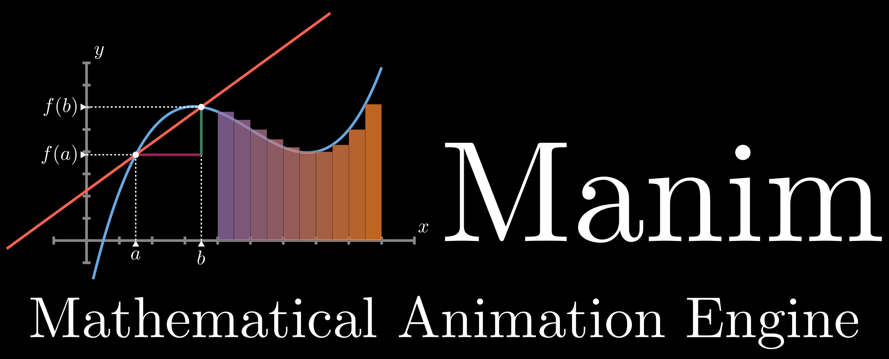

# Manim Project: Depth-First Search Animation

## Overview

This project is dedicated to creating animations using Manim, a mathematical engine. The main objective is to visually illustrate the Depth-First Search (DFS) algorithm, statistical concepts & machine learning. The animations are created in Python, leveraging Manim's extensive capabilities to produce high-quality visuals.

## Video Link
- Manim Tutorial - 10 Objects Display [ENG]: [Manim Tutorial](https://youtu.be/ZsVbCt0uT0M)
- DFS animation [FR]: [DFS Video](https://youtu.be/prcsjvhN_c8?si=x5BY5rC3O7wk8ZSK) 
- DFS animation [ENG]: [DFS Video](https://youtu.be/gcrqye-KYvI?si=fzHtF3jvvSbl9dQV) 
- French Executives Salaries Evolution (1996 to 2022) [ENG]: [Salaries](https://youtu.be/rVqmQHxI0p4) 
- Double pendulum animation - Butterfly effect | ManimCE [ENG]: [Double Pendulum](https://youtu.be/k4zENntIkM0) 
- Koch Snowflake | Manim CE [ENG] : [Koch Fractal](https://youtu.be/5fwHVGms3Zw)
- Linear Regression Animation [ENG] : [Linear Regression](https://youtu.be/P-BVVLD41NM)
- Statistic and parametric models [ENG]: [Handbook of statistics - Part I](https://youtu.be/gGh_hHVSbD8)
- Gaussian Distribution Visualisation [ENG]: [Handbook of statistics - Part II](https://youtu.be/vMAus69cC74)
- Taylor Series [ENG]: [Handbook of statistics - Part III](https://youtu.be/qcLvkmPo7xo)
- KMeans Clustering using 3Blue1Brown's manim library [ENG](https://youtu.be/HZLAqS1Dtg8?si=SpvLudKwOLQ3VeSP)

### Files
- 'XXXXX.py' : Animation python file used to generate videos and create media folder of wanted quality.
- `README.md`: This README file.
