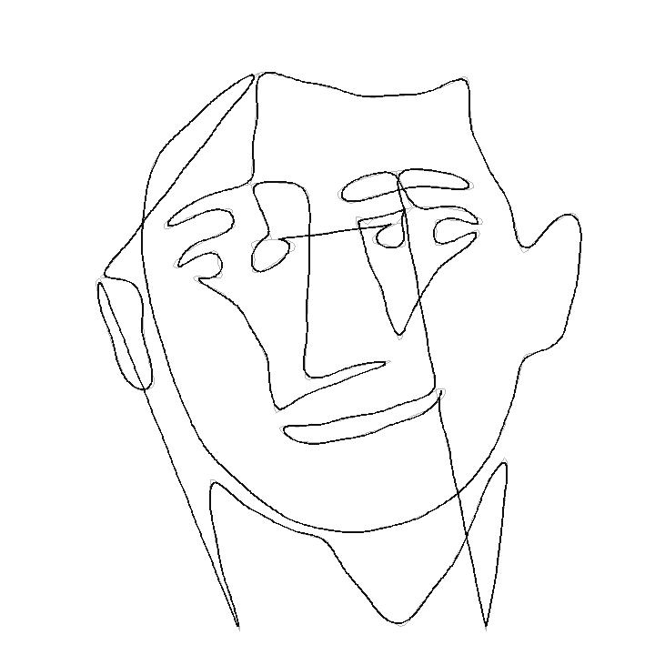

# Fourier Series Portrait

Draw a portrait with a **Fourier series** — a chain of rotating vectors
("epicycles") whose tip traces the image — then explain the maths behind it,
and bookend the whole thing with the house-style intro card.



*Target path (grey) vs. its Fourier reconstruction (black).*

## The film (`FourierPortrait`)

1. **Intro card** — same title treatment as the rest of the repo
   (`animations/2024/Intro.py`).
2. **The drawing** — the real painting appears, then ~150 rotating vectors
   spin up and trace it from a single closed path. The frame-sampled trace is
   swapped for the exact outline, and the painting fades back in behind to show
   the match.
3. **The theory** — the complex Fourier series, its coefficients, the discrete
   transform we actually used, and the real trigonometric form, with a live
   3-vector mini-demo.
4. **Intro card again** — the same card, as a closing bookend.

## How it works

`generate_path.py` turns `assets/louis.png` into one closed curve, using only
numpy + scipy + Pillow (no OpenCV), so it runs offline:

1. grayscale → downscale → gentle blur
2. **Otsu** threshold to isolate the ink
3. **marching squares** (pure numpy) → ordered iso-contour loops that capture
   *internal* features (eyes, nose, mouth), not just the silhouette
4. keep the longest loops, stitch them into one path (greedy nearest-neighbour)
5. resample by arc length, center + scale, save as a complex array

`fourier_draw.py` loads that path, takes its **DFT** (`c_k = FFT(f)/N`), keeps
the lowest frequencies, and animates each term as a vector of length `|c_k|`
spinning at frequency `k`. The tip is the pen.

$$ f(t) = \sum_{k} c_k\, e^{2\pi i k t}, \qquad
   c_k = \frac{1}{N}\sum_{n=0}^{N-1} f(t_n)\, e^{-2\pi i k n / N} $$

## Rendering

```bash
./render.sh Drawing --quick     # fast sanity check of just the drawing
./render.sh                     # the whole film, 480p (FourierPortrait)
./render.sh FourierPortrait -q h  # final 1080p
```

`render.sh` reuses the CNN series' `.venv` if it finds one (so Manim isn't
reinstalled), otherwise it bootstraps a local `.venv` from `requirements.txt`.
Scenes: `FourierPortrait` (default) · `Intro` · `Drawing` · `Theory`.

To draw a **different image**, drop it in and regenerate the path:

```bash
python generate_path.py path/to/image.png   # writes data/louis_path.npy
./render.sh Drawing --skip-assets
```

Tunables live at the top of both files (loop count, sample count, number of
vectors, draw time). `FOURIER_QUICK=1` (or `--quick`) trades fidelity for speed
while iterating.
